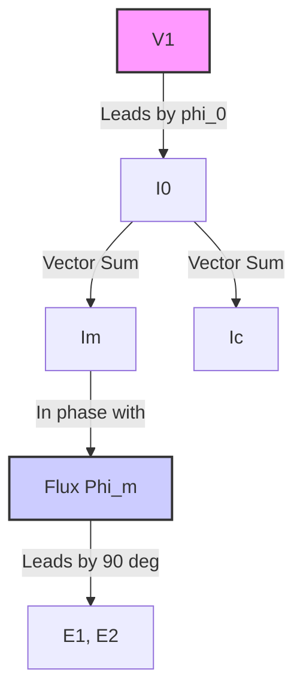
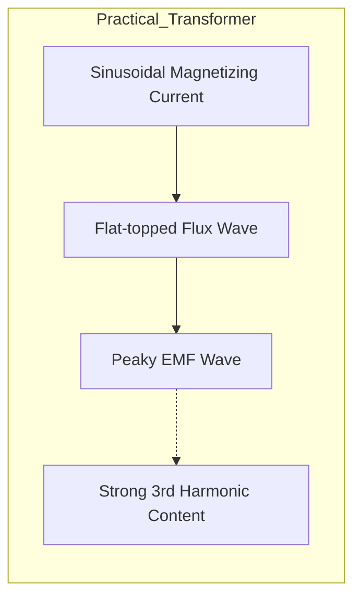
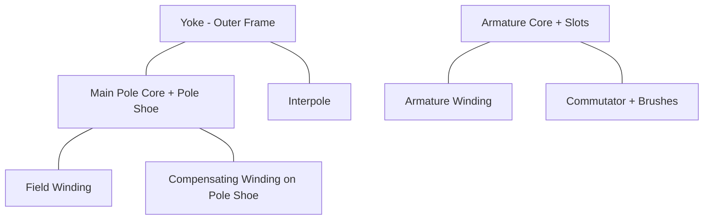
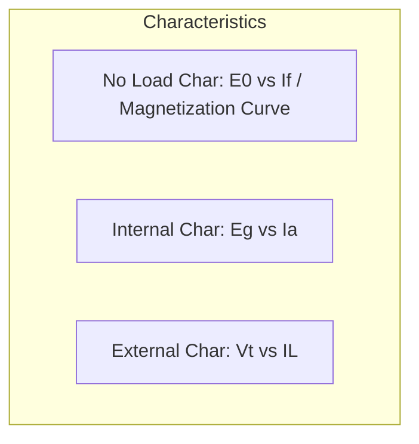

# Complete Electrical Machines Revision Notes (L1 - L6)
## LECTURE 1: Transformer Basics
### Introduction to Machines
 * **Transformer (T/F):** Has the highest efficiency among electrical machines because it has **no rotating parts**.
 * It is a **static device**.
 * It consists of two windings:
   * **H.V** = High Voltage winding
   * **L.V** = Low Voltage winding
### Transformer Types Based on Voltage
 1. **Step-down Transformer:** N_1 > N_2 (Primary turns > Secondary turns)
 2. **Step-up Transformer:** N_1 < N_2
 3. **Isolation Transformer:** N_1 = N_2
*Note: In a transformer, both windings are **not** electrically connected; they are **magnetically coupled**.*
### DC Supply to Transformer
If a DC supply is given to a transformer, its primary winding will **get damaged**.
 * Resistance between the two windings is **Infinity**.
 * For DC, frequency f = 0, so inductive reactance X_L = 2\pi f L = 0. The coil acts as a short circuit allowing dangerously high current to flow.
### Transformer Construction & Parts
 * **Bushing:** Made of porcelain. L.V side has smaller size, H.V side has larger size.
 * **Explosion Vent:** Acts as an emergency exit for pressure.
 * **Conservator:** Half filled with oil. It provides space for the expansion of transformer oil when it is overloaded.
 * **Breather:** Filled with **Silica Gel**. Silica gel absorbs moisture content from the incoming air.
   * *Color before absorbing moisture:* **Blue**
   * *Color after absorbing moisture:* **Pink**
 * **Buchholz Relay:** * Connected between the conservator and the main tank.
   * It is an oil-immersed, unit protection relay.
   * Uses a mercury arc switch.
   * For low disturbance, it produces an **Alarm**. For large faults, it **Trips**.
   * Used only for transformers rated **> 500 kVA**.
 * **Radiator/Fins:** Used for cooling purposes.
 * **Main Tank:** Completely filled with oil. Uses **Neptha oil** (Dielectric strength = 33 \text{ kV/mm}). Today, Aluminum (Al) is also used for tanks due to lower weight.
 * **Core:** Made of **CREGO / Silicon steel** to reduce hysteresis loss. **Laminations** are provided to reduce eddy current loss.
 * **Windings:** Made of Copper. To provide a low reluctance path, soft iron is used for the core.
### Types of Transformers (Based on Core)
 1. **Core Type Transformer:**
   * Minimizes insulation cost.
   * Winding is placed on the outside, core on the inside.
   * Number of Limbs = 2. Number of Yokes = 2.
   * Uses **Concentric winding** (L.V inside, H.V outside).
   * Used in high power applications (**Power Transformers**).
 2. **Shell Type Transformer:**
   * Number of Limbs = 3. Number of Yokes = 2.
   * Uses **Sandwiched winding**.
   * Used in low power applications (**Distribution Transformers**).
### Electric Circuit vs Magnetic Circuit Analogy

| Electric Circuit | Magnetic Circuit |
| :--- | :--- |
| EMF or Voltage (V) | M.M.F = N \cdot I (Amp-turns) |
| Current (I) | Flux (\Phi) (Weber) |
| Resistance R = \rho \frac{l}{A} | Reluctance Rel = \frac{l}{\mu A} |
| Conductivity (\sigma) | Permeability (\mu) |
| Resistivity (\rho) | Reluctivity |
| Conductance G = \frac{1}{R} | Permeance |

### Operating Principle
 * Works on the principle of **Mutual Induction** (Faraday's Law).
 * Primary side EMF: e_1 = -N_1 \frac{d\phi}{dt}
 * If flux \phi = \phi_m \sin(\omega t):
   
 * *Conclusion:* Induced EMF lags the flux by 90^\circ.
#### RMS Value of EMF:
 * **EMF per turn** on both sides of the transformer remains the **same**:
   
### Ideal Transformer
 * No Loss.
 * No Leakage Flux.
 * Infinite Permeability (\mu = \infty) \implies 100% efficiency.
 * No-Load current is zero.
 * Phasor: V_1 = -E_1 and V_2 = E_2.
### Practical Transformer (No Load Condition)
 * No load current (I_0) is **2% to 5%** of rated current.
 * I_0 divides into two components:
   * **Magnetizing current (I_m):** Creates the flux (\Phi_m).
   * **Core loss current (I_c):** Supplies the iron losses.
 * No load power factor (\cos\phi_0) is very low, around **0.1 to 0.2**.
 * Phase angle \phi_0 = 75^\circ \text{ to } 80^\circ.
 * Equations:
   

## LECTURE 2: Practical Transformer, Losses & Tests
### Practical Transformer (Loaded Condition)
Primary current I_1 must balance the no-load current and the load current reflected from the secondary:
Where secondary current referred to primary is I_2' = \frac{I_2}{a}, and the turns ratio a = \frac{N_1}{N_2}.
### Equivalent Circuits
**1. Referred to Primary Side:**
 *  *  *  * **2. Referred to Secondary Side:**
 *  *  *  *  *  * > **Example 1:** A 2000V / 200V, 1-\phi T/F has a secondary resistance of 0.4 \Omega. Find the resistance referred to the primary.
> *Solution:*
> a = \frac{N_1}{N_2} = \frac{2000}{200} = 10
> R_2' = a^2 R_2 = (10)^2 \times 0.4 = 100 \times 0.4 = \mathbf{40 \Omega}
> 
> **Example 2:** A 2000V / 200V, 1-\phi T/F has a H.V side resistance of 0.4 \Omega. Find resistance referred to L.V side.
> *Solution:*
> a = \frac{2000}{200} = 10
> R_{LV} = \frac{R_{HV}}{a^2} = \frac{0.4}{(10)^2} = \mathbf{0.004 \Omega}
> 
### Losses in a Transformer
**1. Core Loss / Iron Loss (P_i):**
Does not depend on load current. P_i = P_e + P_h
 * **Eddy Current Loss (P_e):**
   
   
   Where K_e = \frac{\pi^2}{6\rho}, f = frequency, B_m = max flux density, t = thickness of lamination, v = volume.
   Since B_m \propto \frac{V}{f}, P_e does not depend on frequency if V is varying.
 * **Hysteresis Loss (P_h):**
   
   
   Where x = 1.6 (Steinmetz constant).
**Dependence on V and f:**
 * **Case 1: If \frac{V}{f} = \text{Constant}**
   B_m = Constant.
   P_e \propto f^2
   P_h \propto f
 * **Case 2: If \frac{V}{f} \neq \text{Constant} (e.g., V constant, f varies)**
   P_e \propto V^2 (Constant, does not depend on f)
   P_h \propto f^{1-x} V^x \implies P_h \propto f^{-0.6} (if V is constant)
> **Example 3:** If supply frequency increased by keeping voltage constant, than P_e and P_h will:
> *Solution:* \frac{V}{f} \neq \text{constant}. P_e \propto V^2 \implies P_e is **Constant**. P_h \propto f^{1-1.6} \implies P_h \propto \frac{1}{f^{0.6}} \implies P_h will **Decrease**.
> 
> **Example 4:** If supply voltage increased by keeping frequency constant:
> *Solution:* \frac{V}{f} \neq \text{constant}. P_e \propto V^2 \implies P_e will **Increase**. P_h \propto V^{1.6} \implies P_h will **Increase**.
> 
**2. Copper Loss (P_{cu}):**
Depends on load condition.
> **Example 5:** If at 50% load P_{cu} = 500 W, find P_{cu} at rated load.
> *Solution:*
> 500 = (\frac{1}{2})^2 P_{cu(FL)}
> P_{cu(FL)} = 500 \times 4 = \mathbf{2000 W}
> 
> **Example 6:** If P_i = 100 W and P_{cu} = 200 W at rated load. Find total loss at 75% load.
> *Solution:*
> P_i remains constant = 100 W
> (P_{cu})_{75\%} = (0.75)^2 \times 200 = (\frac{9}{16}) \times 200 = 112.5 W
> Total Loss = 100 + 112.5 = \mathbf{212.5 W}
> 
### Transformer Tests
#### 1. Open Circuit Test
 * Performed at **rated voltage** and **rated frequency**.
 * Determines **rated core loss (P_i)**.
 * No load current (I_0 = 2% to 5%) will flow.
 * We use a **LPF (Low Power Factor) Wattmeter**.
 * Performed on the **L.V side** (meters connected here), while H.V side is kept **Open**.
 * **Formulas derived:**
   
#### 2. Short Circuit Test
 * Performed at **reduced voltage** (5% to 8%).
 * Gives **Series Branch parameters** (Z_{eq}, R_{eq}, X_{eq}) and **rated Copper Loss (P_{cu})**.
 * Performed on the **H.V side** (meters connected here), while L.V side is kept **Short Circuited**.
 * **Formulas derived:**
   
> **Example 7:** In a 2000V/200V T/F, S.C. test result is 80V, 20A, 800W. Find R_{eq} and X_{eq}.
> *Solution:*
> R_{eq} = \frac{800}{20^2} = \frac{800}{400} = \mathbf{2 \Omega}
> Z_{eq} = \frac{80}{20} = \mathbf{4 \Omega}
> X_{eq} = \sqrt{4^2 - 2^2} = \sqrt{16 - 4} = \sqrt{12} = \mathbf{3.46 \Omega}
> 
#### 3. Sumpner Test / Back to Back Test
 * Requires **two identical transformers**.
 * Used to check the **rise in temperature**.
 * Also called **Load Test**.
 * Helps to find the efficiency of the transformer.
#### 4. Polarity Test
 * Used to check the polarity for **parallel operation**.
## LECTURE 3: Efficiency & Voltage Regulation
### Efficiency of Transformer (\eta)
**At rated Load:**
 * **Condition for Maximum Efficiency:** Iron Loss = Copper Loss (P_i = P_{cu})
   
**At 'x' fraction of rated load:**
 * **Condition for Max Efficiency at fraction x:**
   
 * **Load KVA at which max efficiency occurs:**
   
 * **Current at max efficiency:**
   
 * *Note:* Maximum efficiency occurs at **UPF (Unity Power Factor)** load.
> **Example 8:** If at rated load P_i = 200 W, P_{cu} = 800 W, find the load fraction at which max efficiency occurs.
> *Solution:*
> x = \sqrt{\frac{200}{800}} = \sqrt{\frac{1}{4}} = \frac{1}{2} = \mathbf{50\%}
> 
> **Example 9:** A 20kVA, 200V/100V, 1-\phi T/F has rated core loss 800W and rated copper loss 1600W. Find the value of max efficiency at 0.8 pf lagging load.
> *Solution:*
> x = \sqrt{\frac{800}{1600}} = \frac{1}{\sqrt{2}} = 0.707
> \eta_{max} = \frac{0.707 \times 20 \times 0.8}{0.707 \times 20 \times 0.8 + 2(0.8)} \times 100 = \frac{11.312}{11.312 + 1.6} \times 100 = \mathbf{87.6\%}
> 
> **Example 10:** In a T/F full load current is 80A, rated core and copper loss are 0.2kW and 0.8kW. Find current at max eff condition.
> *Solution:*
> x = \sqrt{\frac{0.2}{0.8}} = \frac{1}{2}
> I_{max} = \frac{1}{2} \times 80 = \mathbf{40A}
> 
> **Example 11:** If maximum efficiency of a T/F occurs at 75% (\frac{3}{4}) of load, find the ratio of copper loss to core loss.
> *Solution:*
> x = \frac{3}{4} = \sqrt{\frac{P_i}{P_{cu}}} \implies \frac{P_i}{P_{cu}} = \frac{9}{16} \implies \frac{P_{cu}}{P_i} = \mathbf{\frac{16}{9}}
> 
### Voltage Regulation (V.R.)
 * For calculation of Voltage Regulation, the **Secondary Equivalent Circuit** is considered.
   
**1. For Lagging Load:**
 * Always **positive (+ve)**.
 * **Condition for Maximum V.Reg:** \phi = \theta
   \cos\phi = \cos\theta = \frac{R_{eq}}{Z_{eq}}
   \tan\phi = \tan\theta = \frac{X_{eq}}{R_{eq}}
   (\text{V.Reg})_{max} = Z_{p.u}
**2. For Leading Load:**
 * Can be positive, negative, or zero.
 * **Condition for Zero V.Reg:** \phi = \frac{\pi}{2} - \theta
   \cos\phi = \sin\theta = \frac{X_{eq}}{Z_{eq}}
   \tan\phi = \frac{R_{eq}}{X_{eq}}
 * **Condition for Minimum V.Reg:** Occurs at \phi = 90^\circ (Zero p.f leading load = Pure Capacitor)
   \cos(90^\circ) = 0, \sin(90^\circ) = 1
   (\text{V.Reg})_{min} = -X_{p.u}
> **Example 12:** A 1-\phi T/F has percentage resistance 3% and reactance 4%. Find V.Reg at 0.8 pf lagging load and leading load.
> *Solution:*
> Lagging: V.Reg = 3\% \times 0.8 + 4\% \times 0.6 = 2.4 + 2.4 = \mathbf{4.8\%}
> Leading: V.Reg = 3\% \times 0.8 - 4\% \times 0.6 = 2.4 - 2.4 = \mathbf{0\%}
> 
> **Example 13:** For the same T/F (R=3\%, X=4\%), find max and min value of V.Reg.
> *Solution:*
> (\text{V.Reg})_{max} = Z_{p.u} = \sqrt{3^2 + 4^2} = \mathbf{5\%}
> (\text{V.Reg})_{min} = -X_{p.u} = \mathbf{-4\%}
> 
### All Day Efficiency
 * It is calculated for **Distribution Transformers**.
 * Distribution T/F gives its maximum efficiency at **50% of rated load**.
## LECTURE 4: Auto Transformer & 3-Phase Transformers
### Auto Transformer
 * Has **only one winding**.
 * Current relationship: I = I_L - I_H
 * **Advantages:**
   1. Less Copper is required (Copper saving).
   2. Low Losses.
   3. High Efficiency.
   4. Less Leakage flux.
   5. Better Voltage Regulation.
   6. More power output.
 * **Disadvantage:** Fault current can travel from one side to another side (No electrical isolation).
**Formulas for Auto T/F:**
 * Auto transformation ratio: K = \frac{V_{LV}}{V_{HV}}
 * **Power Transfer:**
   * Inductive power transfer = (1 - K) \times \text{Load Power}
   * Conductive power transfer = K \times \text{Load Power}
 * **Comparisons with 2-Winding T/F:**
   *    *    *    * > **Example 14:** If auto transformation ratio is 0.8 and load power is 20 kW. Find Conductive and Inductive power transfer.
> *Solution:*
> Inductive = (1 - 0.8) \times 20 = 0.2 \times 20 = \mathbf{4 kW}
> Conductive = 0.8 \times 20 = \mathbf{16 kW}
> 
> **Example 15:** A 20kVA, 2000V/200V T/F is reconnected as an auto T/F 2000/2200V. Find kVA transferred to load.
> *Solution:*
> Current I_{HV} = \frac{20000}{2000} = 10A. Current I_{LV} = \frac{20000}{200} = 100A.
> Max load current at 2200V side = 100A.
> Load Power = 2200 \text{V} \times 100 \text{A} = \mathbf{220 kVA}
> 
> **Example 16:** Max kVA transferred to load for the same T/F.
> *Solution:*
> S_{auto} = \left[1 + \frac{HV_{2-wdg}}{LV_{2-wdg}}\right] \times S_{2-wdg} = \left[1 + \frac{2000}{200}\right] \times 20 = 11 \times 20 = \mathbf{220 kVA}
> 
**Applications of Auto T/F:**
 1. Voltage Booster.
 2. Laboratory (Variac).
 3. To start 3-\phi Induction Motor.
### Parallel Operation of Transformers
**Necessary Conditions:**
 1. **Same Polarity**
 2. **Equal Voltage Ratio:** If not same, then a dead short circuit will occur.
 3. **Same Impedance Angle / Same \frac{X}{R} ratio.**
 4. **For proportional Load Sharing:** Per unit impedance (Z_{p.u}) of T/F should be the same on their respective base.
 5. **For 3-\phi T/F:** Phase sequence should be the same.
**Load Sharing Formula:**
If T/F A and B are in parallel sharing Load S_L:
> **Example 17:** Two T/Fs connected in parallel. Impedance Z_A = j3 \Omega, Z_B = j9 \Omega. Load = 360 kVA. Find sharing.
> *Solution:*
> S_A = \frac{j9}{j3 + j9} \times 360 = \frac{9}{12} \times 360 = \mathbf{270 kVA}
> S_B = \frac{j3}{j3 + j9} \times 360 = \frac{3}{12} \times 360 = \mathbf{90 kVA}
> *(Note: The class PDF showed S_A = 90kVA by swapping Z_B and Z_A values in the fraction, ensure you apply the inverse ratio correctly based on the exact impedance values).*
> 
### 3-Phase Transformer Connections
Transformers belonging to the same phasor group can be connected in parallel.
 * **0° Phase shift:** Yy0, Dd0, Dz0
 * **180° Phase shift:** Yy6, Dd6, Dz6
 * **-30° Phase shift (Lag):** Yd1, Dy1
 * **+30° Phase shift (Lead):** Yd11, Dy11
 * *Cannot parallel:* \Delta-Y with \Delta-\Delta, or \Delta-Y with Y-Y.
**Connection Applications:**
 * \Delta-Y: Step-up application (Connected near Generating Station).
 * Y-\Delta: Step-down application (Secondary distribution).
 * \Delta-\Delta: Low voltage, High power application.
 * Y-Y: High voltage, Low power application (Rarely used due to Harmonics problem. A **Tertiary delta winding** is used to solve this).
#### Open Delta (V-V) Connection
If one transformer in a \Delta-\Delta bank fails, it operates in V-V.
 * Capacity reduces to **57.7%** of the original \Delta-\Delta bank.
#### Scott Connection (T-T Connection)
 * Converts 2-\phi to 3-\phi and vice versa.
 * In this, a Teaser T/F is used, whose transformation ratio is \frac{\sqrt{3}}{2} T_p (Main T/F).
### Inrush Current & Harmonics
 * **Inrush Current:** It is a momentary current at **zero voltage** condition. Maximum percentage of harmonics is **2nd harmonic (63%)**, remaining 3rd (37%).
 * **Harmonics:**
   * For Ideal T/F (Linear): If flux is sinusoidal \implies Magnetizing current is sinusoidal.
   * For Practical T/F: If flux is sinusoidal \implies Magnetizing current is **peaked** (contains 3rd harmonic).
   * If magnetizing current is forced to be sinusoidal \implies Flux is **flat-topped** \implies Induced EMF is **peaky** with strong 3rd harmonic content.

### Miscellaneous Concepts
 * **OLTC (On Load Tap Changer):** Tappings are provided at the mid-point on the **H.V side**.
 * **Magnetostriction:** Change in dimension of T/F core when it is energized. Due to this, a **Humming sound** is produced.
 * **Fringing Effect:** Diversion of flux lines from its main path at air gaps. Net cross-section area decreases.
   * **Stacking Factor:** < 1
## LECTURE 5: Loss Separation & DC Machines Intro
### Loss Separation Method
If \frac{V}{f} = \text{Constant}, then B_m = \text{Constant}.
Dividing by f:
This is a straight-line equation (y = c + mx) where:
 * y-axis = \frac{P_i}{f}
 * x-axis = f
 * Slope = B
 * y-intercept = A
> **Example 19:** \frac{P_i}{f} vs f graph has y-intercept = 10, slope = 0.1. Find P_i at 50Hz.
> *Solution:*
> A = 10, B = 0.1
> P_h = A f = 10 \times 50 = 500 W
> P_e = B f^2 = 0.1 \times (50)^2 = 250 W
> P_i = 500 + 250 = \mathbf{750 W}
> 
> **Example 20:** In a T/F at 200V, 50Hz, P_i = 850W. At 100V, 25Hz, P_i = 338W. Find P_i at 60Hz. (Note \frac{V}{f} is constant: 200/50 = 100/25 = 4).
> *Solution:*
> \frac{850}{50} = A + 50B \implies 17 = A + 50B  --- (Eq 1)
> \frac{338}{25} = A + 25B \implies 13.52 = A + 25B --- (Eq 2)
> Solving: 25B = 3.48 \implies B = 0.1392, A = 10.04
> At 60Hz: P_i = 60(10.04) + (0.1392)(60)^2 = \dots *(Substitute values as required based on PDF data).*
> 
### D.C. Machine Introduction
 * **Generator:** Mechanical Energy to Electrical Energy.
 * **Motor:** Electrical Energy to Mechanical Energy.
 * **Stator (Stationary Part):** Field winding is placed here (Concentrated winding).
 * **Rotor (Rotating Part):** Armature winding is placed here (Distributed winding).
### Constructional Parts of DC Machine

**1. Yoke:**
 * Provides mechanical protection.
 * Provides path for \frac{\Phi}{2} flux.
 * Provides support to the pole.
 * Generally, lamination is *not* provided (Made of Cast Iron for small rating, Fabricated steel for large).
 * In Power Electronics application (DC motor fed from converter), lamination is used.
**2. Pole (Core & Shoe):**
 * Made up of Silicon Steel (3% to 5% Silicon) to reduce Hysteresis loss.
 * Generally, Pole Shoe is laminated to reduce Eddy current loss.
**3. Field Winding:**
 * Made of Copper. Concentrated winding.
 * **Shunt Machine:** Thin wire, Large number of turns.
 * **Series Machine:** Thick wire, Small number of turns.
**4. Compensating Winding:**
 * Placed in the slots on the **Pole Shoe**.
 * Connected in **series with armature**.
 * Reduces armature reaction effect (under the pole face) and improves commutation.
 * Used in large rating machines. Minimizes AR under pole face (70% to 75%).
**5. Interpole Winding:**
 * Small poles located between main poles (Interpolar region).
 * Connected in **series with armature**. Shape is tapered to avoid saturation.
 * Improves commutation and minimizes armature reaction in the interpolar region.
 * Minimizes reactance voltage induced in coil undergoing commutation (V_L = L \frac{2I}{t_c}).
**6. Brushes:**
 * Stationary part. Collects current from rotating commutator and supplies to stationary load.
 * **Carbon:** Low rating.
 * **Copper Graphite:** High current & low voltage.
 * Placed electrically on the Interpolar axis (MNA). To improve commutation, brushes are shifted in the direction of rotation (in Generator) & behind direction of rotation (in Motor).
**7. Commutator:**
 * Made of Hard drawn copper segments separated by Mica insulation.
 * Acts as a **Mechanical Rectifier** in Generator (AC to DC) and **Mechanical Inverter** in Motor (DC to AC).
 * Number of commutator segments = Number of coils.
**8. Armature:**
 * Silicon steel lamination, cylindrical shape.
 * Armature winding is placed in slots.
 * Active length of wire = Conductor.
 * \text{Turns} = \frac{\text{Conductors}}{2}.
### Winding Terminology
 * **Coil Span / Pitch:** Distance between two coil sides of a coil.
 * **Pole Pitch:** Peripheral distance between two adjacent poles.
   
 * **Full pitched coil:** Coil span = Pole pitch.
 * **Short pitched coil:** Coil span < Pole pitch.
### Operating Principle
 * Works on **Fleming's Right Hand Rule** (Generator).
   * Thumb = Motion/Rotation
   * First Finger = Field Flux
   * Middle Finger = Induced Current
 * EMF is **Dynamically Induced EMF**: e = B l v \sin\theta.
### Types of Armature Winding
**1. Lap Winding:**
 * For **High Current & Low Voltage**.
 * Parallel paths (A) = mP (where P = poles).
 * Also called **Parallel Winding**.
 * Requires **Equalizer Rings**.
 *  * Progressive: Y_b > Y_f, Retrogressive: Y_b < Y_f.
 * Commutator Pitch Y_c = \frac{Y_w}{2} = \pm m.
**2. Wave Winding:**
 * For **Low Current & High Voltage**.
 * Parallel paths (A) = 2m. (where m=1 simplex, m=2 duplex, m=3 triplex).
 * Also called **Series Winding**.
 * Y_w = Y_b + Y_f = \frac{4(C \pm 1)}{P}.
 * Commutator Pitch Y_c = \frac{Y_w}{2} = \frac{2(C \pm 1)}{P}.
*Note:* Current through each conductor = \frac{I_a}{A}.
Total armature resistance R_a = \frac{x \cdot Z}{A^2} (where x = resistance of one conductor, Z = total conductors).
If we reconnect from Lap to Wave winding, the **Total Power remains the same**.
> **Example 21:** Lap wound, P=6, Z=240, resistance of one cond x = 0.05 \Omega. Find R_a.
> *Solution:*
> A = P = 6
> R_a = \frac{0.05 \times 240}{6 \times 6} = \frac{12}{36} = \mathbf{0.33 \Omega}
> 
> **Example 22:** Lap, P=4. Total armature current = 20A. If reconnected as wave wound, find I_a.
> *Solution:*
> Current capacity I \propto A.
> \frac{I_{\text{wave}}}{I_{\text{lap}}} = \frac{A_{\text{wave}}}{A_{\text{lap}}} = \frac{2}{4} = \frac{1}{2}
> I_{\text{wave}} = \frac{1}{2} \times 20 = \mathbf{10A}
> 
## LECTURE 6: DC Generators & Armature Reaction
### Generated E.M.F Equation
Where:
 * N = speed in rpm
 * P = number of poles
 * \Phi = flux per pole
 * Z = total number of armature conductors
 * A = number of parallel paths (A = P for Lap, A = 2 for Wave).
   *For Wave winding, E_g does not depend on the number of poles (since P and A don't cancel out cleanly as in Lap, wait, actually E_g \propto P in wave, while in Lap A=P so E_g is independent of poles!).* Correction based on standard formula logic, but the note specifically states: **Lap -> A=P \implies E_g = \frac{N \Phi Z}{60} (does not depend on pole).**
### Generator Classification
 1. **Separately Excited**
 2. **Self Excited:**
   * **Shunt Generator:** Field connected in parallel with armature.
     I_a = I_L + I_{sh}, I_{sh} = \frac{V_t}{R_{sh}}
     E_g = V_t + I_a R_a + 2V_b
   * **Series Generator:** Field connected in series with armature.
     I_a = I_L = I_{se}
     E_g = V_t + I_a(R_a + R_{se}) + 2V_b
   * **Compound Generator:** Has both series and shunt fields.
     * **Cumulative:** \Phi_{net} = \Phi_{sh} + \Phi_{se}
     * **Differential:** \Phi_{net} = \Phi_{sh} - \Phi_{se}
     * **Long Shunt:** Shunt field across both armature and series field. I_{sh} = \frac{V_t}{R_{sh}}. E_g = V_t + I_a(R_a + R_{se}) + 2V_b.
     * **Short Shunt:** Shunt field across armature only. I_{sh} = \frac{V_t + I_L R_{se}}{R_{sh}}. E_g = V_t + I_L R_{se} + I_a R_a + 2V_b.
### Conditions for Voltage Build-up (Self-Excited)
 1. Field pole should contain **residual flux**.
 2. Should be **started at No Load** (for Shunt). Series Gen must be started ON load.
 3. R_{sh} should be **less than Critical Resistance**.
 4. Speed of prime mover must be **more than Critical Speed**.
 5. Field coil orientation and direction of rotation should be correct (to aid residual flux).
> **Example 23:** A 200V DC Shunt Gen supplies 80kW power. R_a = 0.4 \Omega, R_{sh} = 50 \Omega. Find E_g.
> *Solution:*
> I_L = \frac{80000}{200} = 400A
> I_{sh} = \frac{200}{50} = 4A
> I_a = I_L + I_{sh} = 404A
> E_g = V_t + I_a R_a = 200 + 404(0.4) = 200 + 161.6 = \mathbf{361.6V}
> 
> **Example 24:** A Short Shunt DC Gen supplying 50A to a 200V load. R_a = 0.5 \Omega, R_{sh} = 115 \Omega, Brush drop = 1V/brush, R_{se} = 0.6 \Omega. Find E_g & I_a.
> *Solution:*
> Voltage across shunt V_{sh} = V_t + I_L R_{se} = 200 + 50(0.6) = 230V.
> I_{sh} = \frac{230}{115} = 2A.
> I_a = 50 + 2 = \mathbf{52A}.
> E_g = 200 + 30 + 52(0.5) + 2(1) = 230 + 26 + 2 = \mathbf{258V}.
> 
> **Example 25:** Same parameters, but as Long Shunt. Find E_g & I_a.
> *Solution:*
> I_{sh} = \frac{200}{115} = 1.7A.
> I_a = 50 + 1.7 = \mathbf{51.7A}.
> E_g = V_t + I_a(R_a + R_{se}) + 2V_b = 200 + 51.7(0.5 + 0.6) + 2 = 200 + 56.87 + 2 = \mathbf{258.9V}.
> 
### Characteristics & Applications

 * **Voltage Regulation:** \text{V.Reg} = \frac{V_{NL} - V_{FL}}{V_{FL}} \times 100
 * **Shunt Generator:** Has **Drooping Characteristic** (+ve V.Reg). Application: Battery Charging, Pilot exciter.
 * **Series Generator:** Has **Rising Characteristic** (-ve V.Reg). Application: Voltage Booster.
 * **Compound Generator:**
   * *Cumulative (Over, Flat, Under):* Flat has Zero V.Reg. Application: Constant DC Supply.
   * *Differential:* Steep drooping. Application: Arc welding.
### Armature Reaction
The effect of armature flux on the main field flux is called Armature Reaction.
 1. **De-magnetizing effect:** Reduction in main flux.
   \Phi_d = \Phi_a \sin\theta
 2. **Cross-magnetizing effect:** Distortion in main flux.
   \Phi_c = \Phi_a \cos\theta
**Effects of Armature Reaction:**
 * In Generator: Flux at **Trailing pole tip** increases, and flux at **Leading pole tip** decreases.
 * In Motor: Vice versa.
 * Magnetic Neutral Axis (MNA) is shifted in the **direction of rotation** in a Generator (and opposite in a Motor).
**Methods to Reduce Armature Reaction:**
 1. Pole core slotting.
 2. Pole stacking.
 3. Pole chamfering.
 4. **Compensating Winding:**
   
> **Example 26:** In a 4 pole, lap wound DC Gen, there are 480 armature conductors. Ratio of pole arc to pole pitch is 80%. Find compensating winding conductors per pole.
> *Solution:*
> Cond/pole = \frac{480}{(4 \times 4)} \times 0.8 = \frac{480}{16} \times 0.8 = 30 \times 0.8 = \mathbf{24}
> 
### Commutation
 * The process of current reversal in a coil while passing through a brush.
 * **Commutating Time (t_c):** The time for which two segments remain short circuited.
 * **Linear Commutation:** If current reversal takes place within commutating time. (Successful commutation).
 * **Delayed Commutation:** If current reversal does not take place within t_c, leading to sparking.
 * **Reactance Voltage:** Induced EMF in the coil undergoing commutation which opposes the reversal of current.
   
*End of Revision Notes*
